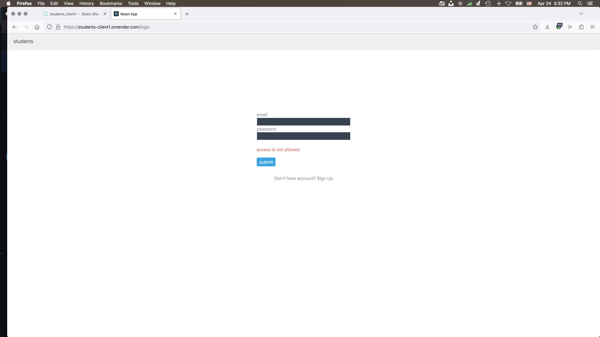

## admin-panel

[deploy link](https://students-client1.onrender.com)

[backend repository](https://github.com/project1dmtrackdev/students-server)

### Description

This project is one of the iTransition's internship tasks. Purpose: to learn how to create fullstack project (db+server+client)

### Features

Auth and registration modules
You can manage users access
All data is stored in sql-db

### Stack

-   TypeScript
-   React
-   Material UI
-   node.js
-   express
-   postgreSQL (ORM: Sequalize)

### Preview

