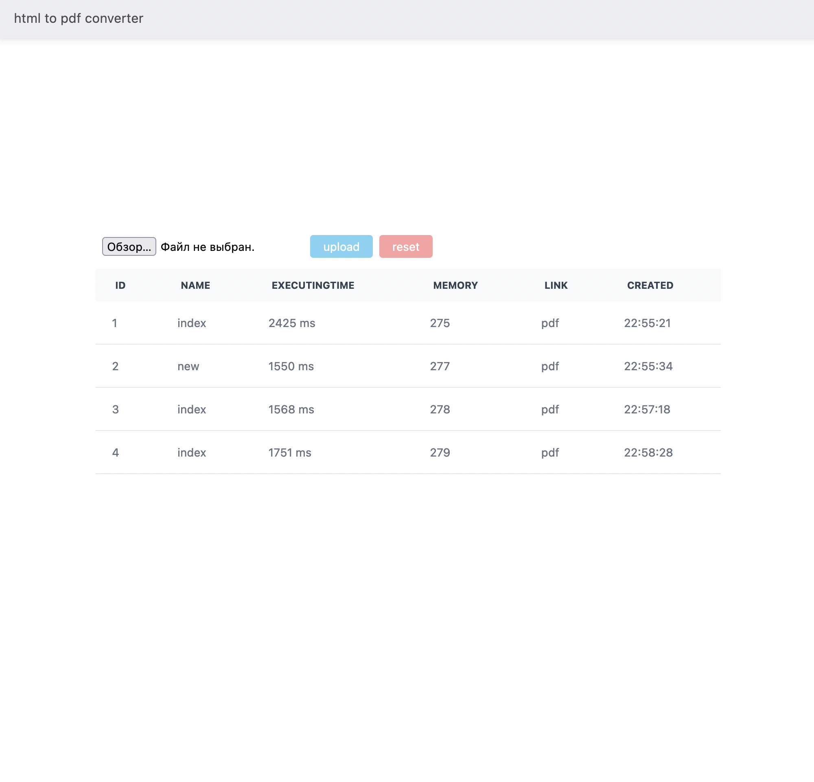

## students

[https://students-client1.onrender.com](https://students-client1.onrender.com)

### Description

This project is one of the iTransition's internship tasks.

### Features

Auth and registration modules
You can manage users access
All data is stored in sql-db

### Stack

-   TypeScript
-   React
-   Material UI
-   node.js
-   express
-   postgreSQL (ORM: Sequalize)

### Preview

